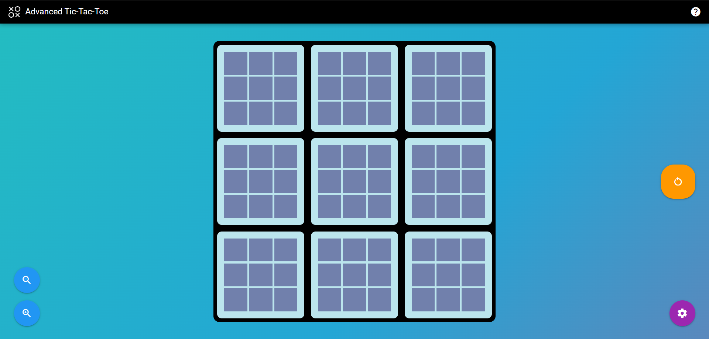
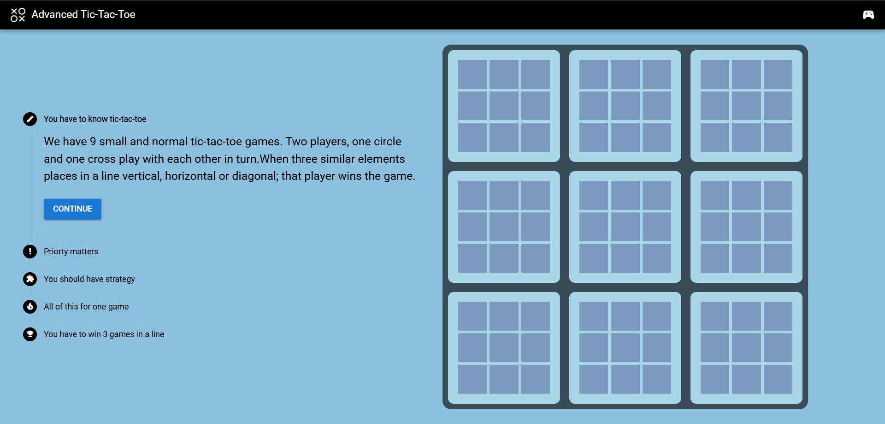
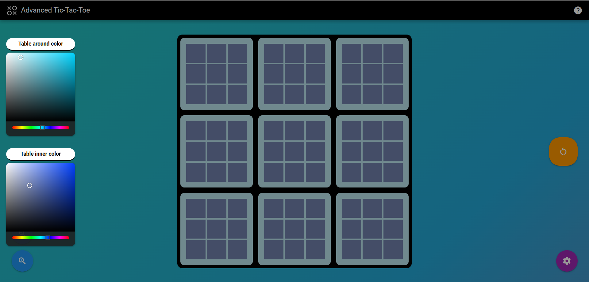
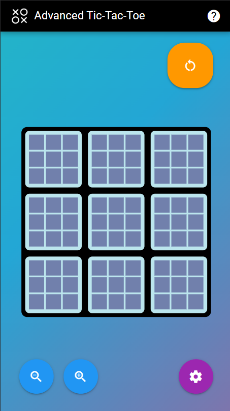
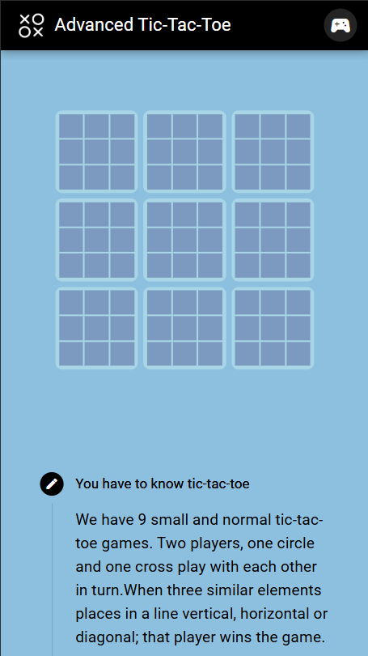
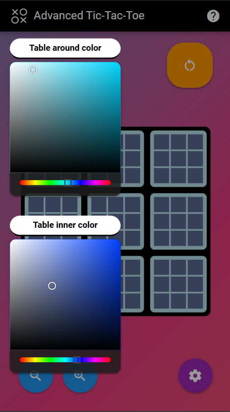

# Advanced Tic Tac Toe Game!

- **Description**:

This is a different Tic Tac Toe game which has 9 tic tac toe games inside it 😁.

Actually my main reason of developing this game was to learn Quasar framework and Vue alongside developing a creative and new Game 😎.

I've also created an interactive tutorial of rules of this game.

You can also customize size and colors of the board for better visuality.

I've fully customized the game for different screen sizes by making it fully responsive.

You can try this game from <a href="https://adv-xo.vercel.app/" target="_blank">Here</a> or build it on your machine.

- **Screenshots**:

    1. Desktop:

        <table>
                <tr><td></td></tr>
                <tr><td></td></tr>
                <tr><td></td></tr>
        </table>

    2. Mobile:

        <table>
            <tr>
                <td></td>
                <td></td>
                <td></td>
            </tr>
        </table>

        